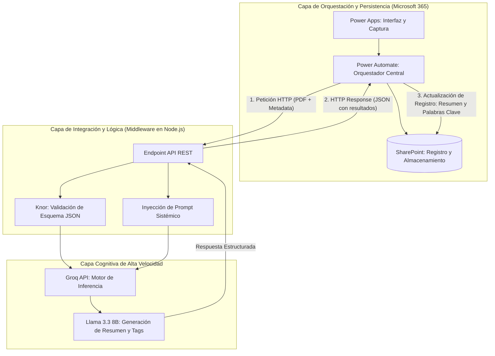
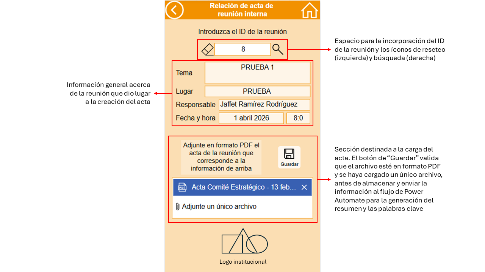
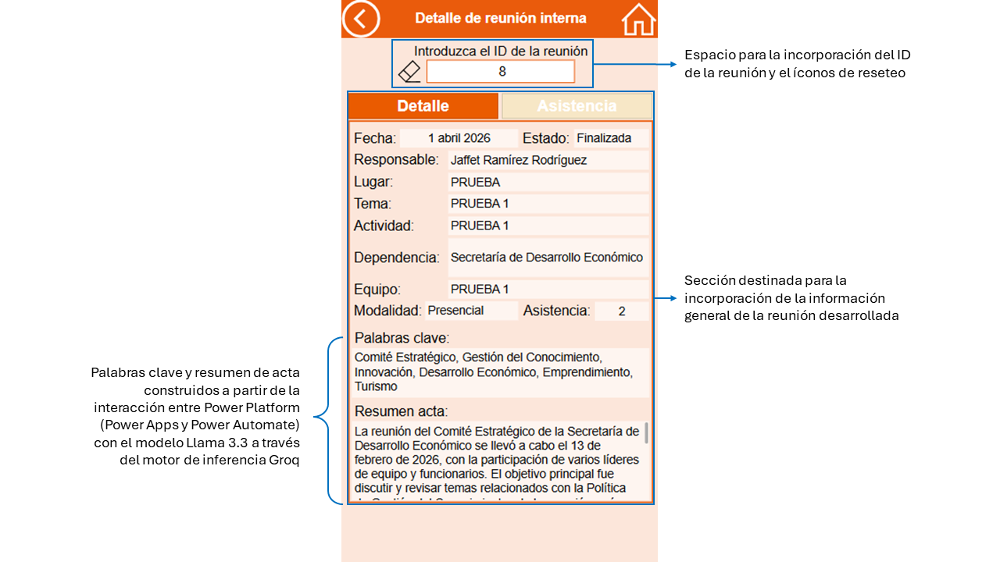
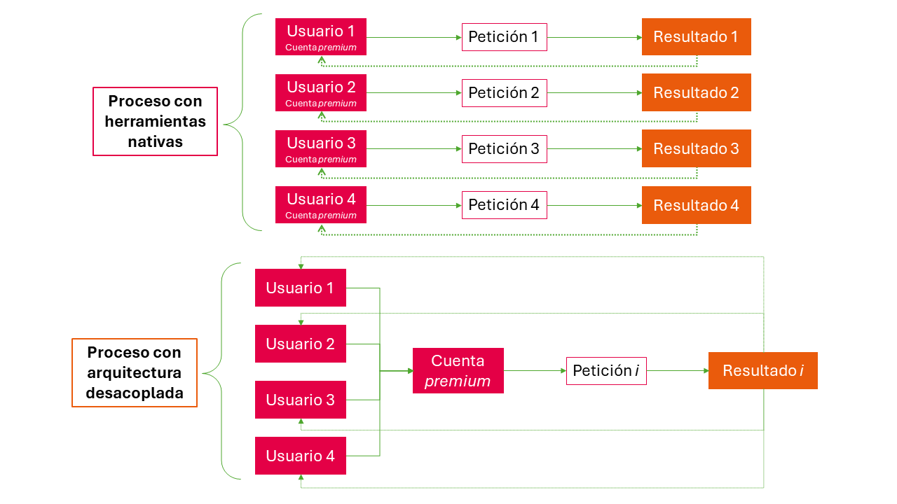
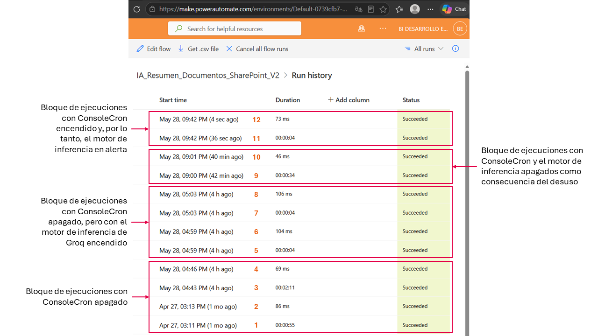
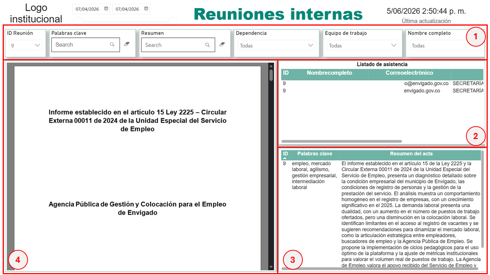

# 🏛️ Anexo Técnico: Sistema Desacoplado de Gestión Documental con IA


> **Nota Académica e Institucional:** Este repositorio constituye el Anexo Técnico del proyecto de grado de Maestría. Por políticas de ciberseguridad, protección de datos (Ley 1581) y reserva del sumario institucional de la Secretaría de Desarrollo Económico, el código fuente presentado ha sido **sanitizado**. Las credenciales, *API Keys*, URLs de producción y datos de funcionarios han sido reemplazados por variables de entorno y datos ficticios.

---

## 1. Arquitectura del Sistema (Diagrama de Flujo)

El siguiente diagrama detalla la orquestación completa. Se destaca cómo el entorno de Microsoft 365 actúa como capa de persistencia y visualización, mientras que el procesamiento cognitivo se delega a una infraestructura externa de alto rendimiento.



## 2. Manual de Usuario (Guía Visual de Operación)

La interfaz de usuario fue diseñada bajo el principio de **abstracción arquitectónica**. El funcionario de la Secretaría de Desarrollo Económico no interactúa con líneas de código, ni percibe el enrutamiento de datos hacia servidores externos; todo el ciclo de vida del documento ocurre dentro del entorno seguro y familiar de Power Apps y Microsoft 365.

### 2.1. Interfaz de Captura y Validación Documental
El sistema actúa como el primer anillo de seguridad. La interfaz valida en tiempo real la integridad de la carga, restringiendo la extensión de los archivos exclusivamente a formato `.pdf` y garantizando que se procese un único documento por transacción para no saturar la ventana de contexto del modelo de inteligencia artificial.



### 2.2. Visualización de Resultados en Tiempo Real
Una vez el usuario autorizado envía el acta, el sistema entra en un estado de procesamiento. En cuestión de segundos, la interfaz consulta el registro actualizado en SharePoint y renderiza en pantalla el **Resumen Ejecutivo** y las **Palabras Clave** generadas semánticamente por Llama 3.3, permitiendo al funcionario validar la extracción cognitiva inmediatamente.



### 2.3. Integración de Power Automate a través de HTTP Reuest
Esta integración de _Power Platform_ con el _middleware_ externo, permite consolidar la eficiencia en el uso de recursos, al permitir que dicha solicitud sea centralizada a través de una única cuenta _Premiun_ (efecto _funnel_), en vez de agotar créditos con varias cuentas que usen instrumentos nativos para buscar el mismo resultado.



### 2.4. Escenarios en el flujo de ejecución de Power Automate
La velocidad de repuesta en la entraga del resultado final, está asociado a las condiciones en las que se integran la solicitud del flujo (HTTP Request), el motor de inferencia en Groq y el servicio ConsoleCron. Cada solicitud en Power Automate se ejecuta en dos partes consecutivas, la primera envía la solicitud y la segunda recibe el resultado para disponerlo en el repositorio de SharePoint. Los flujos 1 al 4, evidencian el par de corridas (1-2 y 3-4) en los que la primera solicitud se tarda algunos segundos (0:55 y 2:11) como consecuencia del arranque en frío dado que ConsoleCron no estaba manteniendo el motor de inferencia en alerta permanente. Las ejecuciones 5 a 8, evidencian dos pares de corridas en donde las demoras son significativamente mínimas en la primera solicitud (4 segundos ambas) dado que el motor de inferencia ha sido encendido previamente en la corrida anterior. La ejecución 9, vuelve a tener una latencia alta (34 segundos), debido a que, por desuso, el motor de inferencia se ha apagado nuevamente. Finalmente, la ejecución 11, a pesar de estar alejada —en tiempo— de la anterior, se ejecuta en sólo 4 segundos, dado que, para esta corrida, ConsoleCron está manteniendo el motor de inferencia en alerta constante (encendido).



## 3. Fragmentos de Código Clave (Middleware en Node.js)

A continuación, se exponen los componentes críticos desarrollados en el microservicio (alojado y ejecutado externamente) que garantizan la integridad de los datos y el procesamiento cognitivo mediante el modelo fundacional Llama 3.3 (8B). Por motivos de ciberseguridad, **el código ha sido sanitizado** y las credenciales se manejan estrictamente a través de variables de entorno (`process.env`).

### 3.1. Validación Estricta con Librería Knor
Para evitar "alucinaciones estructurales" o el procesamiento de cargas de datos corruptas desde Microsoft 365, se implementó la librería `knor` en el endpoint de recepción. Esto garantiza que el JSON entrante cumpla con un esquema riguroso antes de consumir recursos de inferencia.

```javascript
const { k } = require('knor');

// Definición del esquema estricto esperado desde Power Automate
const actaSchema = k.object({
    idActa: k.string().required(),
    fechaComite: k.string().required(), // Formato ISO 8601
    textoExtraido: k.string().min(100).required(), // Previene el envío de PDFs en blanco
    usuarioRemitente: k.string().email()
});

// Middleware de validación en la ruta POST
function validarPayload(req, res, next) {
    const validacion = actaSchema.validate(req.body);
    if (!validacion.isValid) {
        console.warn(`Intento de carga inválida por: ${req.body.usuarioRemitente || 'Desconocido'}`);
        return res.status(400).json({ 
            error: "Estructura de datos inválida. Transacción abortada.", 
            detalles: validacion.errors 
        });
    }
    next();
}
```

### 3.2. Prompt Engineering Sistémico
El comportamiento del modelo de inteligencia artificial se controla mediante instrucciones precisas (System Prompt) que enmarcan su rol institucional. Esta parametrización es vital para adaptar un modelo de propósito general a las rigurosidades del derecho administrativo público.

```javascript
const construirPromptSistemico = () => {
    return `
    Actúas como un experto analista documental de la Secretaría de Desarrollo Económico 
    de la administración pública colombiana. Tu objetivo es analizar el texto extraído 
    de actas de comité y extraer información estratégica con precisión quirúrgica.
    
    Reglas de extracción obligatorias:
    1. Redacta un 'resumenEjecutivo' de máximo 150 palabras. Mantén un tono formal, 
       objetivo y elimina el ruido conversacional.
    2. Identifica los compromisos o decisiones principales y menciónalos explícitamente.
    3. Extrae un arreglo de 'palabrasClave' (máximo 5 términos técnicos) relevantes 
       para la indexación en repositorios históricos.
    
    Restricción de Formato: Debes responder ÚNICA y EXCLUSIVAMENTE con un objeto JSON válido.
    `;
};
```
### 3.3. Petición HTTP a la API de Groq
El núcleo de la extrapolación de la carga cognitiva. Se establece una conexión asíncrona segura con la API de Groq, forzando la salida del modelo Llama 3.3 a un formato JSON estructurado que luego será devuelto a Power Automate.

```javascript
const procesarConLlama = async (textoActa) => {
    const url = '[https://api.groq.com/openai/v1/chat/completions](https://api.groq.com/openai/v1/chat/completions)';
    
    // Configuración del Payload para el modelo Open Source
    const payload = {
        model: "llama-3.3-8b-versatile",
        messages: [
            { role: "system", content: construirPromptSistemico() },
            { role: "user", content: `Analiza el siguiente texto del acta: ${textoActa}` }
        ],
        temperature: 0.1, // Temperatura baja (0.1) para maximizar la determinancia y evitar alucinaciones
        response_format: { type: "json_object" } // Forzar estructura para SharePoint
    };

    try {
        const response = await fetch(url, {
            method: 'POST',
            headers: {
                'Authorization': `Bearer ${process.env.GROQ_API_KEY}`, // Sanitizado por seguridad
                'Content-Type': 'application/json'
            },
            body: JSON.stringify(payload)
        });

        if (!response.ok) {
            throw new Error(`HTTP error! status: ${response.status}`);
        }

        const data = await response.json();
        return JSON.parse(data.choices[0].message.content); // Retorno del JSON limpio
        
    } catch (error) {
        console.error("[CRITICAL] Error en inferencia LPU Groq:", error);
        throw new Error("Fallo en la comunicación con el motor cognitivo.");
    }
};
```
### 3.4. Estrategia de Disponibilidad: Mitigación del "Cold Start"
Uno de los mayores retos en arquitecturas *Serverless* (sin servidor) es la latencia inicial cuando el contenedor del microservicio entra en estado de hibernación por inactividad (*Cold Start*). Para la administración pública, un retraso de 15 a 30 segundos en la primera consulta del día genera una mala experiencia de usuario.

Para solucionar esto sin incurrir en costos de "concurrencia provisionada", se integró **ConsoleCron** como estrategia *Keep-Alive*.

**Configuración del Ping Automatizado:**
Se programó una tarea (Cron Job) que realiza una petición de tipo `HEAD` o un `GET` de bajísimo peso al servidor cada 14 minutos. Esto mantiene el entorno de ejecución Node.js permanentemente "caliente" en la memoria del servidor.

```yaml
# Configuración del Job en ConsoleCron (Formato de expresión Cron)
Nombre del Job: Keep-Alive-Middleware-Envigado
Frecuencia: */10 * * * * # Se ejecuta cada 10 minutos
Endpoint URL: [https://api-middleware-envigado.com/ping](https://api-middleware-envigado.com/ping)
Método HTTP: GET
```

## 4. Visualización y analítica
El agrupamiento esquematizado de la información favorece la consulta de resultados históricos, especialmente a la hora de asignar filtros de búsqueda que permiten la extracción de datos puntuales, sin importar los lejanos en el tiempo y sin la necesidad de aludir a la memoria humana para llegar a ellos. Este panel de visualización ubica la sección de filtros por categorías especiales y tiempo que favorecen la búsqueda histórica y relevante de actas o metadatos (resúmenes y palabras clave) almacenados en los repositorios. El recuadro 1 contiene los filtros que permiten la búsqueda histórica de la reunión con su respectiva acta, bien sea por el ID, algún tenxto específico en el resumen o las palabras clave, la dependencia, el equipo de trabajo o el nombre del funcionario responsable de la reunión. El recuadro 2 muestra el listado de asistencia de los participantes a la reunión muestra el listado de asistencia a la reunión. El cuadro 3 deja ver el resumen y las palabras clave extraídas generadas por el modelo Llama 3.3 a través del motor de inferencia Groq. El último recuadro permite visualizar el documento original almacenado en el repositorio de datos en SharePoint de Microsoft 365.



## 5. Evidencias de Pruebas de Validación (QA) y Rendimiento

Para certificar la viabilidad del sistema antes de su despliegue en el entorno de producción de la Secretaría de Desarrollo Económico, se ejecutó una batería de pruebas de estrés, validación lógica y rendimiento. 

### 5.1. Matriz de Casos de Prueba (Edge Cases)
A continuación, se documentan los escenarios críticos evaluados para garantizar la tolerancia a fallos del ecosistema:

| ID | Componente | Descripción del Escenario | Resultado Esperado | Resultado Obtenido | Estado |
| :---: | :--- | :--- | :--- | :--- | :---: |
| **QA-01** | Power Apps | Carga de archivo con extensión no soportada (`.docx`, `.jpg`). | La interfaz bloquea el botón de envío y alerta al usuario. | Botón inhabilitado. Alerta visual generada correctamente. | ✅ Pass |
| **QA-02** | Middleware (Knor) | Petición HTTP desde Power Automate con un payload incompleto (sin `textoExtraido`). | Knor intercepta y rechaza con HTTP 400 (Bad Request). | API devuelve HTTP 400. Power Automate registra el error y notifica. | ✅ Pass |
| **QA-03** | Motor IA (Groq) | Inferencia de un acta extensa (aprox. 5,000 palabras) evaluando tiempos de respuesta. | Retorno del JSON estructurado en un tiempo < 5 segundos. | Respuesta procesada en 3.2s con formato JSON perfecto. | ✅ Pass |
| **QA-04** | Seguridad (API) | Intento de consumo del *endpoint* externo sin el Token de Autorización válido. | El servidor rechaza la conexión con HTTP 401 (Unauthorized). | Conexión denegada. Protección del microservicio confirmada. | ✅ Pass |

